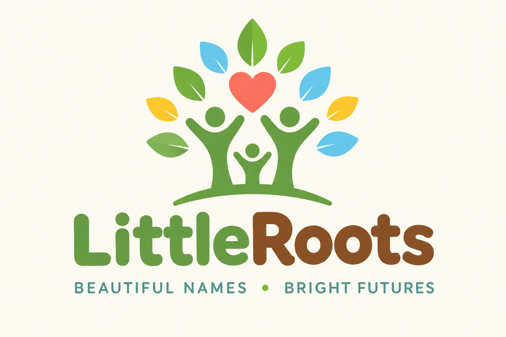
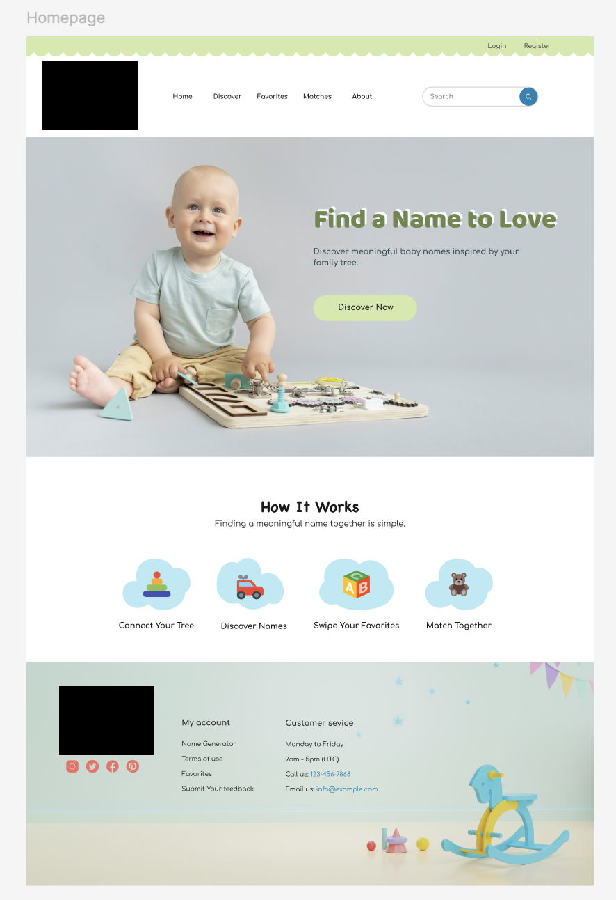

# Overview
This project will be a FamilySearch based baby name generator web app. It will suggest baby names to you that are unique to your ancestry.

## Features
* Generate potential baby names from your family tree.
* Front-End similar to that of swiping on a dating app.
* Ability to link your account with a spouse to see the names you both matched on.
* Page of history and meaning for each name.
* Ability to filter suggestions by boy, girl, or surprise.

## Website Mock-up

### Logo



### Welcome Page



## Getting Started

### Prerequisites
* [Node.js](https://nodejs.org/) (includes npm)

### Installation
From the project's root folder, install the dependencies:

```bash
npm install
```

This installs the dependencies for every workspace in one step, so you don't need to run it inside each folder.

### Running the App
Start the development servers:

```bash
npm run dev
```

Once it's running, open the local URL Vite prints in the terminal (usually http://localhost:5173).

> **Note:** Only the client runs for now. The server hasn't been built yet, so you'll see a `No workspaces found: --workspace=server` error in the terminal. You can ignore it; the client still starts normally.
